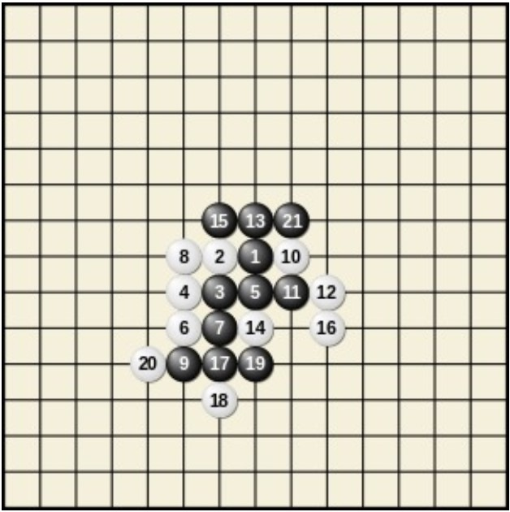

<h1>Opgave 4 - <i>GOMOKU</i></h1>

Voor deze programmeeropgave gaan we het spel <b>Gomoku</b> programmeren, dat verdacht veel lijkt op het bekende Vier-op-een-rij. Het is de bedoeling een klasse gobord te maken, die onder meer memberfuncties heeft als drukaf, menszet en randomzet. Uiteraard heeft deze klasse ook een constructor en een destructor. Verder moeten gedane menselijke zetten met behulp van een stapel ongedaan gemaakt kunnen worden. 

De mogelijkheid bestaat om gebruik te maken van een aantal voorbeeldfiles, van waaruit de opgave stap voor stap kan worden gedaan. Je kunt ook je eigen files met andere functies maken, maar gesplitst moet er worden; niet-gebruik van onderstaand viertal heeft geen invloed op het cijfer. De files zijn allereerst (zie verderop voor gebruik met Code::Blocks, op eigen risico):

<ol><li>File met main: hoofd.cc.</li>
<li>Headerfile met klassen: gobord.h.</li> 
<li>Bijbehorende C++-file: gobord.cc. </li>
<li>En de bijpassende makefile (let op de TABs).</li></ol>

<h2>Spelregels</h2>

Het wellicht meer bekende spel Vier-op-een-rij gaat als volgt. Op een 6 bij 7 bord wordt gespeeld met witte en zwarte schijfjes. Om de beurt leggen de spelers —wit W en zwart Z geheten— een schijfje met hun eigen kleur op een nog leeg vakje, en wel op het onderste lege veld uit een kolom naar keuze. Als een kolom vol is, kan hierin niet meer een schijfje gelegd worden. Zwart mag altijd beginnen. Het spel is afgelopen als het bord vol is, of als één der spelers gewonnen heeft. Een speler wint als er minstens vier stenen van zijn kleur direct horizontaal naast elkaar staan, of verticaal, of diagonaal. Bij Gomoku mag de speler die aan de beurt is zijn/haar schijf steeds op een willekeurige lege plaats neerleggen, dus niet noodzakelijk onderin een kolom. En vijf (of meer) naast elkaar, in plaats van vier, is winnend.

<h2>Programmeerregels</h2>
We spelen het spel als volgt. Allereerst mag gekozen worden of de eerste speler een mens of computer is, en idem voor de tweede speler. De "computer" zet volledig willekeurig (gebruik random ( ) uit ; denk aan srand ( )). (Liefhebbers mogen hier natuurlijk hun eigen creativiteit inzetten, door bijvoorbeeld in de buurt van eerdere stenen te zetten, of door (dreigen) te winnen als dat kan.) Daarna mag de grootte van het bord gekozen worden: het aantal rijen m en het aantal kolommen n, en met hoeveel h op een rij er gewonnen wordt. Boter-kaas-en-eieren heeft m = n = h = 3. En tot slot moet er gekozen worden hoeveel spelletjes er gespeeld worden als de computer tegen zichzelf speelt. Als een speler aan zet is, en er precies één spelletje gespeeld moet worden, wordt de stand, oftewel de bordpositie, —in eenvoudig formaat— op het scherm getoond, en kan de menselijke speler zijn/haar zet doen, of juist de laatste eigen zet (en meteen de tussenliggende zet van de tegenstander) terugnemen. Als er een reeds bezette plek wordt geselecteerd, moet de speler natuurlijk opnieuw kiezen. Computerzetten worden steeds direct gedaan. En er is uiteraard een functie die bepaalt of het spel is afgelopen, en of er dan iemand (wie?) gewonnen heeft.

Schrijf een constructor voor de klasse gobord die een pointerstructuur aanlegt, waarbij ieder vakje, naast bijvoorbeeld een char als inhoud, tevens een array met 8 pointers naar de onmiddellijke buren heeft: middenboven (0), rechtsboven (1), rechts (2), rechtsonder (3), middenonder (4), linksonder (5), links (6) en linksboven (7). De vakjes aan de randen bevatten uiteraard diverse NULL-pointers. Het bord is dus niet een m bij n array, maar een zeer ingewikkelde pointerstructuur.

Alle zetten moeten op een stapel worden bijgehouden, en menselijke zetten kunnen daarmee teruggenomen worden. Zodra een speler zet, wordt de zet, bestaande uit een tweetal gehele getallen, opgeslagen. Dit onderdeel is zeker niet eenvoudig; mocht het ontbreken, dan kost dat een punt. 

Het is de bedoeling om een vijftal files te produceren: de eerste bevat main en het menutje, de tweede (zeg gobord.h, zie boven) bevat de klasse-definitie voor gobord, en de derde (zeg gobord.cc, zie boven) bevat de functies uit die klasse. Evenzo zijn er files stapel.h en stapel.cc. Maak ook een makefile. Code::Blocks-gebruikers: doe deze opgave liever op een Linux-machine. Maar het kan wel: open een nieuw project via "File -- New project -- Empty project", vul wat in, en voeg de drie files toe via "Project -- Add files", en daarna het project compileren op de gebruikelijke manier. Of, op eigen risco, lees over projecten.

